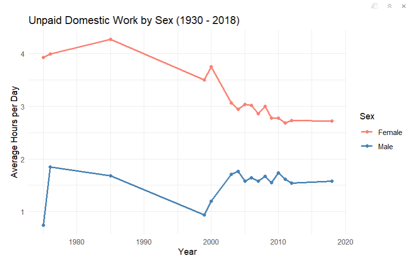

# West Coasters Final Project

## Question
What are the best predictors of time spent on paid work?

## Codebook
| Variable | Description | Categorial Code |
|----------|-------------|-----------------|
| SAMPLE | Sample |
| PERNUM | Person number |
| IDENT | Identifier |
| HHID | Household ID |
| PID | Person identifier |
| SERIAL | Person serial number |
| YEAR | Year diary kept |
| AGE | Age |
| SEX | Sex | 1=Male, 2=Female |
| CIVSTAT | Martial status | 1=Married, 2=Separated,divorced, 3=Widowed, 4=Never married |
| EDUC | Education | 1=0-8th, 2=9-11th, 3=high school graduate, 4=some college, 5=college graduate, 6=post college |
| RECWGHT | Recommended sample (day) weight removing low quality diaries and missing age or sex |
| ETHNIC | Ethnicity | 1=White, 2=Black, 3=Asian, 4=Other, 5=Hispanic |
| AGEYNGST | Age of youngest child |
| DISAB | Has disability | 0=Not available, 1=Yes |
| REGIONC | Census region | 1=Northeast, 2=Midwest, 3=South, 4=West |
| URBAN | Urbancity | 0=Rural, 1=Urban |
| HHTYPE | Household type | 1=Married with child, 2=Married, no child, 3=Female HH with child, 4=Female HH no child, 5=Male HH, 6=Single male, 7=Single female, 8=Other |
| NADULT | Number of adults in the household |
| UNDER5 | Number of children under 5 in the household |
| UNDER18 | Number of children under 18 in the household |
| EMPSTAT | Employment status | 1=Full time, 2=Part time, 3=Not employed, 4=Working, hours unknown |
| EMPSP | Employment status of spouse | 1=Full time, 2=Part time, 3=Unknown hours, 4=Not working |
| WAGELM | Employment income from last month |
| WKHRS | Number of hours worked per week | -4=0 to 10 hrs, 61=Between 61 to 80 hrs, 81=More than 80 hrs |
| NOEMPLOY | Employment status | 0=No, 1=Yes |
| HOMEMAKR | Homemaker status | 0=No, 1=Yes |
| FULLTIME | Full time employment | 0=No, 1=Yes, 4=Working hours unknown |
| PARTTIME | Part time employment | 0=No, 1=Yes, 4=Working hours unknown |

### Time Variables
| Variable | Description |
|----------|-------------|
| ACT_CHCARE | Child care |
| ACT_CIVIC | Adult care, civic, voluntary, and religious activities |
| ACT_EDUCA | Education |
| ACT_INHOME | In home free time leisure |
| ACT_MEDIA | Media and computing |
| ACT_MISSING | Missing activities |
| ACT_OUTHOME | Out of home free time and leisure |
| ACT_PCARE | Personal care |
| ACT_PHYSICAL | Sports, exercise, and outdoor activities |
| ACT_TRAVEL | Travel |
| ACT_UNDOM | Unpaid domestic work |
| ACT_WORK | Paid work |

## Highlighted Figures
### EDA

